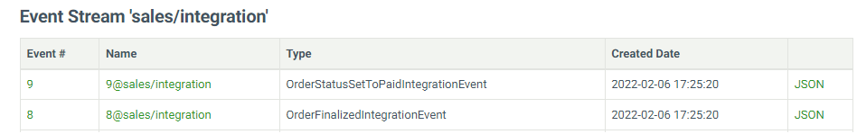
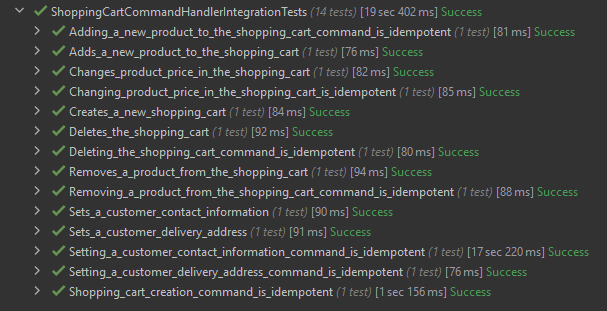

# VShop - Modular Monolith with DDD

## About
VShop is a sample .NET application built as **Modular Monolith** with **Domain-Driven Design (DDD)** approach. Each module is an independent vertical slice with its custom architecture. The overall integration between modules is mostly based on the event-driven approach to achieve greater autonomy between individual modules. Essentially, the application demonstrates a mix of architecture styles and patterns:
- Simple CRUD, single-tier, single-layer
- Domain-Driven Design N-layered (DDD)
- Clean Architecture 
- Command and Query Responsibility Segregation (CQRS)
- Event-Driven Architecture (EDA)
- Event Sourcing (ES)

## Inter-module communication

The VShop application uses two communication types:
- Asynchronous event-based communication - a module publishes event(s) when something notable happens, and other modules subscribe to those events. The Publish-Subscribe pattern is built on top of the EventStoreDB database by exchanging messages via event streams (each module is publishing to its own "integration" stream). This way, events are used to implement business transactions that span multiple modules, in an eventual consistent manner.



- Synchronous communication between modules based on local contracts - module can publish events to other modules and execute commands on other modules. The VShop application uses **MediatR** to propagate events synchronously across modules.

## Process Manager (PM)

Event Sourcing is used to build a process manager instance's state and as a log of all incoming and outgoing messages:
- Inbox - stores all incoming integration and domain events.
- Outbox - stores all outgoing commands and events (both integration and domain). 

Process manager understands the concept of time so it can schedule events used as:
- an internal alarm system preventing the PM instance from ending up in a zombie state (not being able to finish the process). 
- a timeout messages - this would activate appropriate system components to take corresponding actions depending on the PM's current state.

```csharp
internal class OrderingProcessManager : ProcessManager
    {
        public EntityId ShoppingCartId { get; private set; }
        public EntityId OrderId { get; private set; }
        public OrderingProcessManagerStatus Status { get; private set; }
        
        public OrderingProcessManager()
        {
            RegisterEvent<ShoppingCartCheckoutRequestedDomainEvent>(Handle);
            RegisterEvent<OrderPlacedDomainEvent>(Handle);
            RegisterEvent<PaymentGracePeriodExpiredDomainEvent>(Handle);
            RegisterEvent<PaymentSucceededIntegrationEvent>(Handle);
            RegisterEvent<OrderStatusSetToPaidDomainEvent>(Handle);
            RegisterEvent<OrderStockProcessingGracePeriodExpiredDomainEvent>(Handle);
            RegisterEvent<OrderStockProcessedIntegrationEvent>(Handle);
            RegisterEvent<OrderStatusSetToPendingShippingDomainEvent>(Handle);
            RegisterEvent<ShippingGracePeriodExpiredDomainEvent>(Handle);
        }

        private void Handle(ShoppingCartCheckoutRequestedDomainEvent @event, Instant _) 
            => RaiseCommand(new PlaceOrderCommand(OrderId, ShoppingCartId));

        private void Handle(OrderPlacedDomainEvent @event, Instant now)
        {
            RaiseCommand(new DeleteShoppingCartCommand(ShoppingCartId));
            
            // Schedule a reminder for payment.
            ScheduleReminder
            (
                new PaymentGracePeriodExpiredDomainEvent(OrderId),
                now.Plus(Duration.FromMinutes(Settings.PaymentGracePeriodInMinutes))
            );
        }
        
        // Removed for brevity.
}
```

## Testing

Both unit and integration tests have been implemented for Sales and ProcessManager modules. The **classical (Detroit) school** principles were followed as they decrease tight coupling with implementation details. 

Due to asynchronous communication, some tests must wait for the result at certain times. To correctly implement such tests, the Sampling technique and implementation described in the [Growing Object-Oriented Software, Guided by Tests](https://www.amazon.com/Growing-Object-Oriented-Software-Guided-Tests/dp/0321503627) book was used.

Tests preview:



## Atomicity and resiliency

The several approaches are used when dealing with the data consistency problem:
- Using the Event Sourcing pattern - integration events are stored within the aggregate boundaries and re-published into the designated integration stream. ES subscriptions are used for integration event monitoring and re-publish.
- Using the Outbox pattern - a transactional database table as a message queue used as a base for an event-creator component that subsequently creates and publishes events.

## Idempotence

All command and event handlers are idempotent - processing the same event or command wouldn't do any harm. In most of the cases, the system simply queries the message store (EventStoreDB) and determines if the command/event being received has already been processed. If so, the system would redispatch the outgoing events and commands, thereby allowing the continuation of the process in case of retry.

Aggregate store:
```csharp
    public async Task<TAggregate> LoadAsync(EntityId aggregateId, CancellationToken cancellationToken = default)
    {
        IReadOnlyList<MessageEnvelope<IBaseEvent>> messageEnvelopes = await _eventStoreClient
            .ReadStreamForwardAsync<IBaseEvent>(GetStreamName(aggregateId), cancellationToken);

        if (messageEnvelopes.Count is 0) return default;

        TAggregate aggregate = new();
        aggregate.Load(messageEnvelopes.ToMessages());
        
        IList<MessageEnvelope<IBaseEvent>> processed = messageEnvelopes
            .Where(e => e.MessageContext.Context.RequestId == _context.RequestId).ToList();

        if (!processed.Any()) return aggregate;
        
        foreach ((IBaseEvent @event, IMessageContext messageContext) in processed)
            _messageContextRegistry.Set(@event, messageContext);
        
        await PublishAsync(processed.ToMessages(), cancellationToken);   // Re-publish messages.
        aggregate.Restore();   // Change aggregate's state.

        return aggregate;
    }
```     

## Message Format

Message schema is declared using **Protocol Buffers** and used to generate (de)serialization code when saving messages to databases (EventStoreDB and Postgres). Since Protocol Buffer schema is index-based there is no impact when changing a field name (which is a major plus). 

Protocol Buffers format is used for both command and event messages (Note: some commands are pushed to the ES database by PM). 

Here is an example of a command message (protobuf format):

```shell
syntax = "proto3";
option csharp_namespace = "VShop.Modules.Sales.Infrastructure.Commands";

import "SharedKernel/SharedKernel.Infrastructure/_schemas/uuid.proto";
import "SharedKernel/SharedKernel.Infrastructure/_schemas/gender.proto";

message SetContactInformationCommand 
{
    Uuid shopping_cart_id = 1;
	string first_name = 2;
	string middle_name = 3;
	string last_name = 4;
	string email_address = 5;
	string phone_number = 6;
	Gender gender = 7;
}
```

## Versioning by Upcasting

The former events are being transformed to their newest versions:

```csharp
    public MessageEnvelope<TMessage> ToMessage<TMessage>(ResolvedEvent resolvedEvent) where TMessage : IMessage
    {
        object data = _eventStoreSerializer.Deserialize
        (
            resolvedEvent.Event.Data.Span.ToArray(),
            _messageRegistry.GetType(resolvedEvent.Event.EventType)
        );

        object UpcastMessage() => _messageRegistry.TryTransform   // Perform message upcasting.
        (
            resolvedEvent.Event.EventType,
            data,
            out object transformed
        ) ? transformed : data;

        if (UpcastMessage() is not TMessage message) return default;

        MessageMetadata messageMetadata = _eventStoreSerializer.Deserialize
            <MessageMetadata>(resolvedEvent.Event.Metadata.Span.ToArray());

        return new MessageEnvelope<TMessage>
        (
            message,
            messageMetadata.ToMessageContext()
        );
    }
```

## Roadmap

List of features:

| Name                     | Status |
| ------------------------ | -------- |
| Billing Module |In Progress |
| Sales Module |  Completed |
| Catalog Module |  Completed |
| Process Manager Module |  Completed |
| Shipping Module |  TODO |
| Administration Module | TODO  |
| Identity Module |  TODO |

## How to Run

### Install .NET 6
Download and install .NET 6 SDK.
### Run using Docker Compose
You can run whole application using docker compose from root folder:

```shell
docker-compose up
```

It will create the following services (separate for testing and development):
- EventStore database (EventStoreDB)
- Relational database per module (Postgres)

## Technology

List of technologies, frameworks and libraries used for implementation:
- [.NET 6.0](https://dotnet.microsoft.com/download) (platform)
- [Serilog](https://serilog.net/) (structured logging) 
- [Postgres](https://hub.docker.com/_/postgres) database
- [EventStoreDB](https://hub.docker.com/r/eventstore/eventstore/) database
- [Quartz.NET](https://www.quartz-scheduler.net/) (scheduler for Process Manager)
- [FluentValidation](https://fluentvalidation.net/) (data validation)
- [MediatR](https://github.com/jbogard/MediatR) (mediator implementation)
- [Postman](https://www.getpostman.com/) (API tests)
- [XUnit](https://xunit.net/) (testing framework)
- [Polly](https://github.com/App-vNext/Polly) (resilience and transient-fault-handling library)
- [Swashbuckle](https://github.com/domaindrivendev/Swashbuckle) (Swagger automated documentation)
- [Google Protobuf](https://developers.google.com/protocol-buffers) mechanism for serializing structured data
- [Nodatime](https://nodatime.org/) clock
- [OneOf](https://github.com/mcintyre321/OneOf) (F# style unions for C#)
- [AutoMapper](https://automapper.org/)
